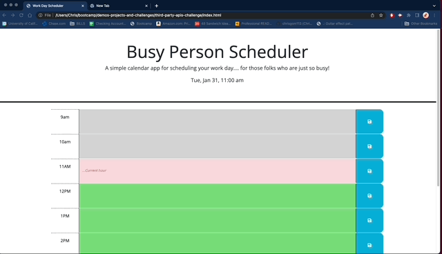
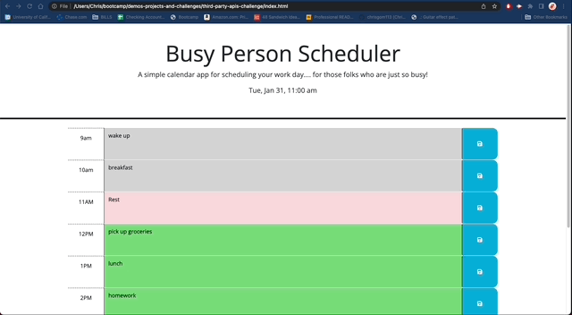
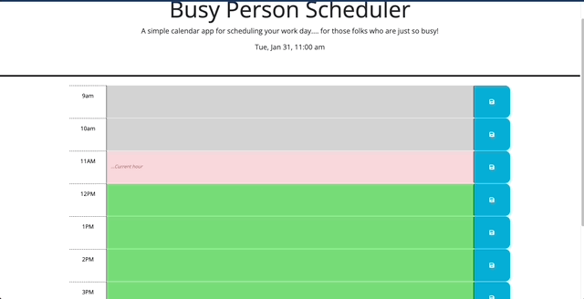

# Busy Person Scheduler : A Third-Party API Challenge

## Description

This code uses HTML, CSS, Javascript, and APIs to run a simple calendar app for the average 'busy' user. The app allows user to save events for each hour of the day, as needed, whereby their saved events persist after page refresh.

App uses jQuery to programmatically modify HTML and CSS so the hour-blocks in the calendar are color-coded based on the time of day to show whether the hour has passed, is now, or is in the future. To assist with this, app uses Day.js API to check the current time against the one stated in either hour-block.

The biggest take-aways from finishing this project were: practicing DOM traversal using jQuery/Javascript, getting accustomed to using the Day.js API, some practice with using bootstrap components, honing HTML and CSS use, and, last but not least, getting more practice with browser DevTools (e.g., console, application).

Great challenge!

See acceptance criteria below for details and specifics.

URL to live page: https://chrisgom113.github.io/busy-person-scheduler/


## Acceptance Criteria

```md
GIVEN I am using a daily planner to create a schedule
WHEN I open the planner
THEN the current day is displayed at the top of the calendar
WHEN I scroll down
THEN I am presented with timeblocks for standard business hours
WHEN I view the timeblocks for that day
THEN each timeblock is color coded to indicate whether it is in the past, present, or future
WHEN I click into a timeblock
THEN I can enter an event
WHEN I click the save button for that timeblock
THEN the text for that event is saved in local storage
WHEN I refresh the page
THEN the saved events persist
```


## Table of Contents

Not needed. Simple app


## Installation

None required. Live URL: https://chrisgom113.github.io/busy-person-scheduler/


## Usage

User can access the app using this url below:

https://chrisgom113.github.io/busy-person-scheduler/


On the page, user will see colored hour blocks for regular business hours as well as the current date and time displayed on the top of the page. 

User can begin typing in any hour block. Input placeholder text will show '...current hour' for the hour block that corresponds to the current time.

Once entry is complete, user can click the blue icon to the right of each block to save the entry. When page is refreshed, the saved entry will persist on the page. 

If user tries to click the 'save' icon when no event has been entered, a window alert appears advising user to enter event before saving.

Based on user needs, user can scroll to the bottom of the page and click the 'reset' button to clear all inputs.

'Save' and 'Reset' functions both use browser's 'local.storage' property. This can be checked in the 'application' tab of the devtools.

The following animations helps demonstrate the application functionality from the perspective of the user:

Save Event


Clear Event(s)


Empty Input Alert



## Credits

N/A

## License

N/A

## Features

- Bootstrap utilization adds clean layout and 'save' icon. Adds alert style that responds to save and reset buttons.
- Javascript/jQuery to incorporate Day.js API that displays current time. Time is checked against HTML references to programmatically color-code the hour blocks, relative to current time.
- window alert that responds to attempt to click save button with empty input
- Web browser local storage API to allow event entries to persist on the page.
